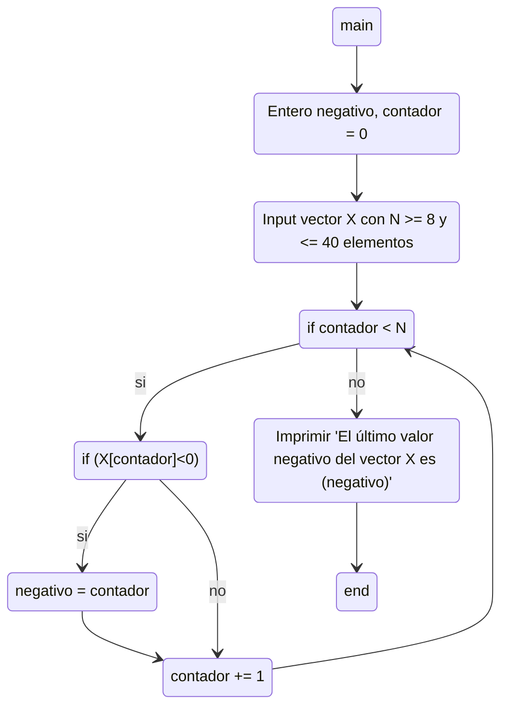

#### 2) Dibujar un diagrama de flujo de datos que permita cargar y determinar e imprimir la posición del último elemento negativo dentro de un vector X con datos numéricos enteros ingresados por el usuario, con entre 8 y 40 elementos.

