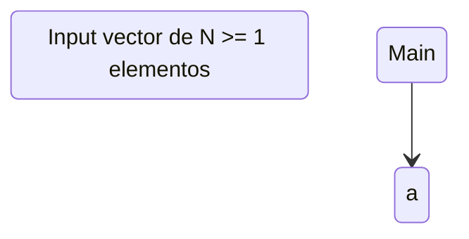

## Ejercicio 3: Escriba un diagrama de flujo para procesar un vector A con capacidad para contener 10 elementos enteros:
#### a) que permita al usuario cargar el vector con valores entre -15 y 50
#### b) que controle y no permita errores en la carga de datos, evitando valores que no están en el rango permitido (use estructura de control Until o Hasta, para validar el dato)
#### c) que calcule y muestre la suma de todos los elementos del vector
#### d) que calcule y muestre la suma de todos los elementos del vector, de las posiciones impares
#### e) que calcule y muestre el promedio de todos los elementos del vector
#### f) que calcule el porcentaje de valores negativos ingresados, teniendo en cuenta que los 10 elementos representan el 100%

