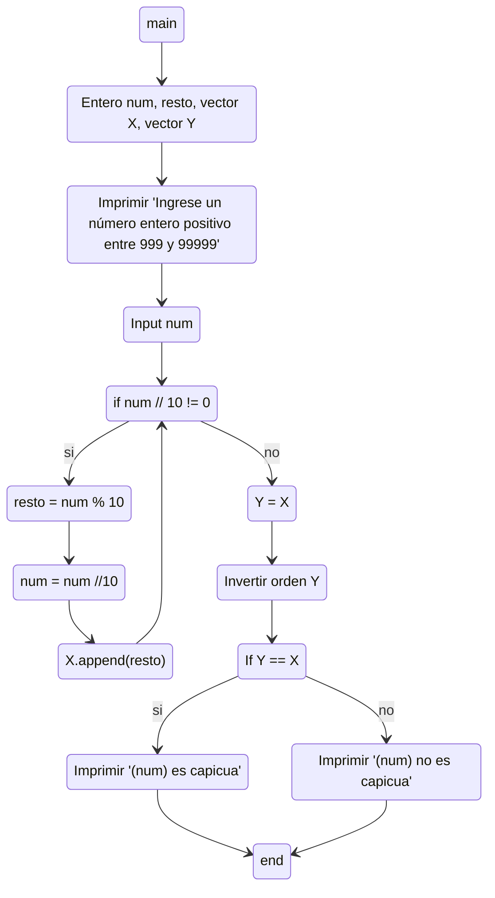

##### 4) Escriba un diagrama de flujo que permita ingresar un número entero positivo entre 999 y 99999, que imprima el número ingresado, que lo descomponga en unidad, decena, centena, unidad de mil, decena de mil (según el tamaño del número), y que determine e imprima un mensaje avisando si el número ingresado es capicúa o no. Por ejemplo, si el número ingresado fuera 564, tendríamos Unidad=4, Decena=6 y Centena=5, y habrá que imprimir “564 no es capicúa”, en cambio si el número ingresado fuera 565, habría que imprimir “565 es capicúa”.

