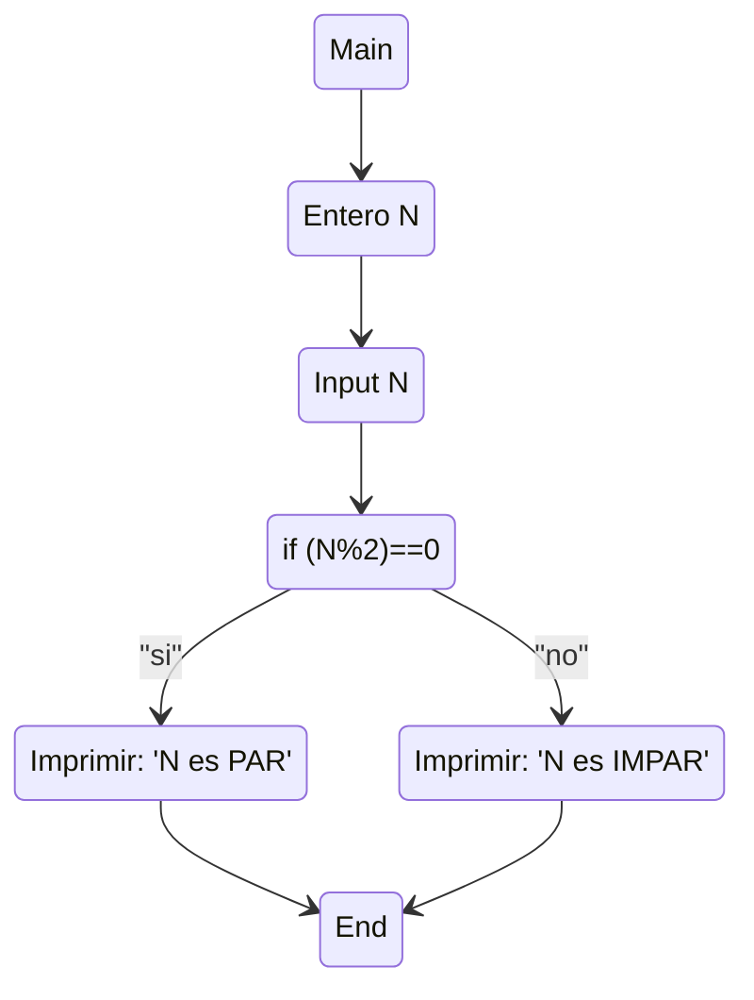

# Ejercicio 1: Ingresar un número natural en la variable N. Determinar e imprimir un mensaje informando si 'N es PAR' o si 'N es IMPAR'

```mermaid
stateDiagram-v2
state "Entero N" as N
state "Input N" as N1
state "if (N%2)==0" as COND
state "Imprimir: 'N es PAR'" as RES1
state "Imprimir: 'N es IMPAR'" as RES2
    Main --> N
    N --> N1
    N1 --> COND
    COND --> RES1 : "si"
    COND --> RES2 : "no"
    RES1 --> End
    RES2 --> End
```
