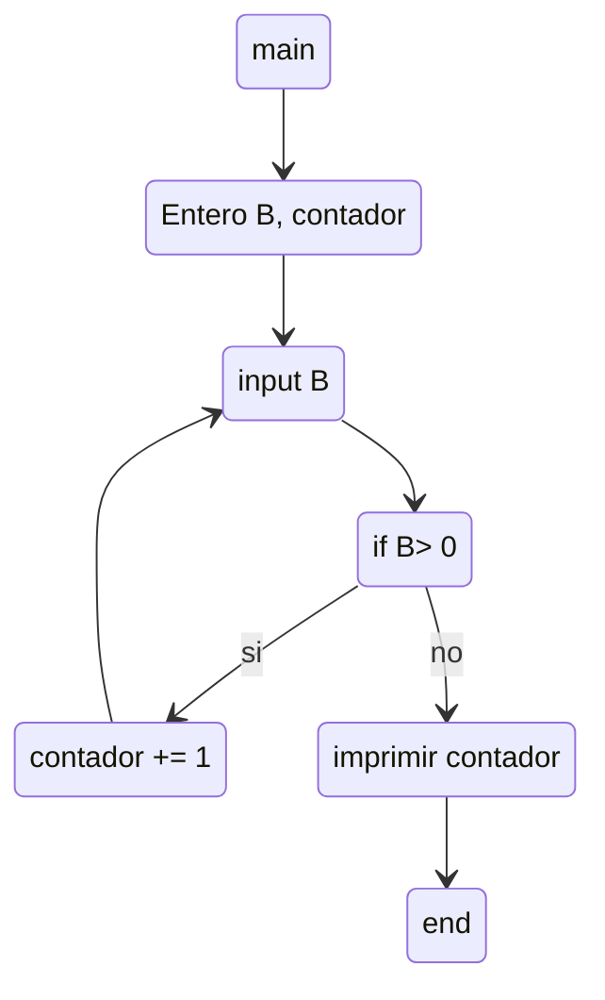

#### 10) Ingresar números enteros en la variable B y, MIENTRAS el valor ingresado en B sea
POSITIVO, calcular la cantidad de números ingresados e imprimirla en un mensaje. 

```mermaid
stateDiagram-v2
state "Entero B, contador" as def
state "input B" as B
state "if B> 0" as cond
state "contador += 1" as cont
state "imprimir contador" as print
    main --> def
    def --> B
    B --> cond
    cond --> cont:si
    cont --> B
    cond --> print: no
    print --> end
```
