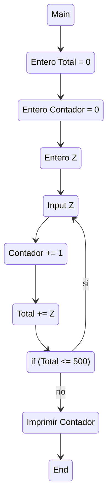

# Ejercicio 11: Ingresar números enteros en la variable Z, HASTA que la suma de los valores ingresados en Z sea mayor a 500. Determinar e imprimir la cantidad de números ingresados

```mermaid
stateDiagram-v2
state "Entero Total = 0" as DEC1
state "Entero Contador = 0" as DEC2
state "Entero Z" as DEF1
state "Input Z" as IN1
state "if (Total <= 500)" as COND1
state "Contador += 1" as RES1
state "Total += Z" as RES2
state "Imprimir Contador" as OUT1
    Main --> DEC1
    DEC1 --> DEC2
    DEC2 --> DEF1
    DEF1 --> IN1
    IN1 --> RES1
    RES1 --> RES2
    RES2 --> COND1
    COND1 --> IN1 : si
    COND1 --> OUT1 : no
    OUT1 --> End
```
