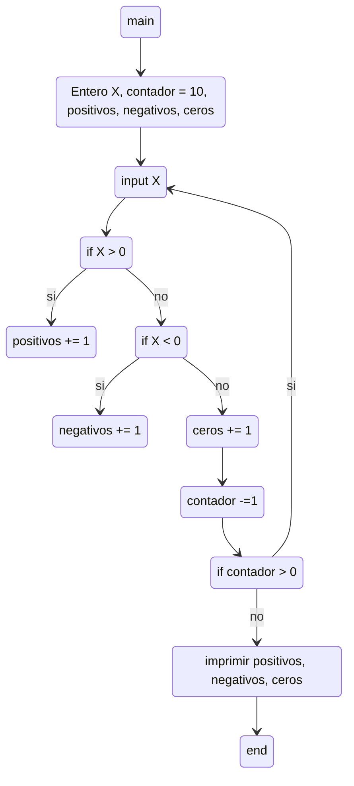

#### Ejercicio 12) Ingresar 10 números enteros usando la variable X. Determinar e imprimir un mensaje informando: la cantidad de números POSITIVOS, la cantidad de números NEGATIVOS y, la cantidad de CEROS ingresados.

