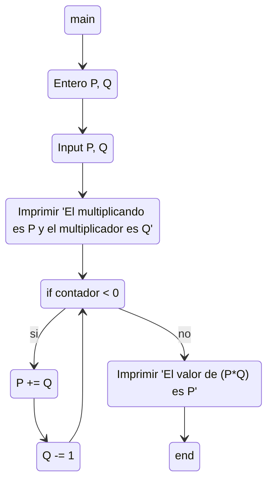

```mermaid
stateDiagram-v2
state "Entero P, Q" as def
state "Input P, Q" as var
state "Imprimir 'El multiplicando es P y el multiplicador es Q'" as print1
state "if contador < 0" as cond
state "P += Q" as multi
state "Q -= 1" as cont
state "Imprimir 'El valor de (P*Q) es P'" as resul
    main --> def
    def --> var
    var --> print1
    print1 --> cond
    cond --> multi : si
    multi --> cont
    cont --> cond
    cond --> resul : no
    resul --> end
```
