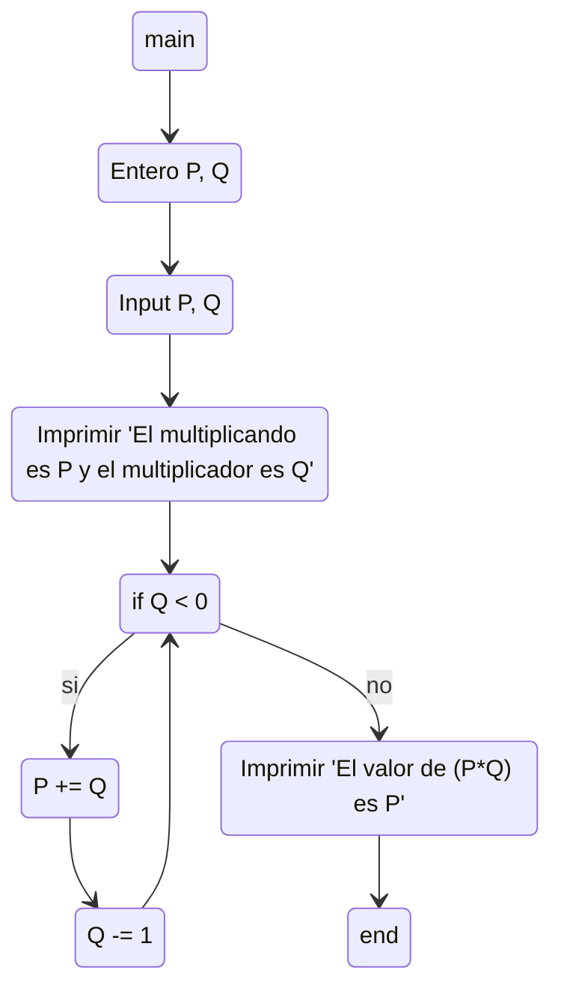

#### 13) Ingresar 2 números naturales P y Q, donde P representa el multiplicando y Q el multiplicador. Se pide que, utilizando solamente la operación de suma, calcule el resultado de la operación P * Q e imprima el valor de P, de Q y de P * Q.

