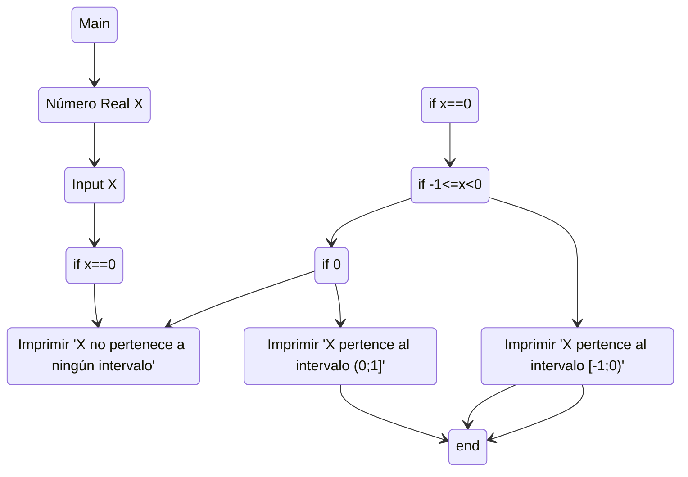

#### Ejercicio 2: Escriba un diagrama de flujo que permita ingresar un valor numérico real en una variable llamada X, y que determine si X pertenece o no, a alguno de los intervalos [-1;0) o (0;1] (o a ninguno de ellos), imprimiendo un mensaje que diga a cuál intervalo pertenece.

