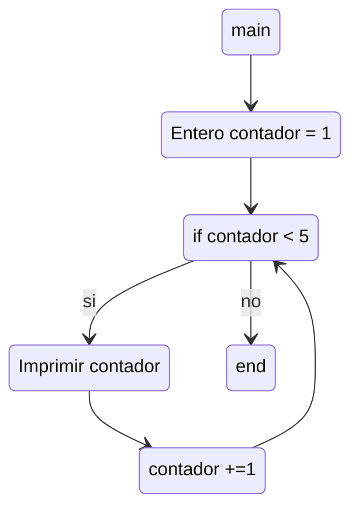

```mermaid
stateDiagram-v2
state "Entero contador = 1" as cont
state "if contador < 5" as cond
state "Imprimir contador" as print
state "contador +=1" as suma
    main --> cont
    cont --> cond
    cond --> print: si
    cond --> end: no
    print --> suma
    suma --> cond
    
    
 
```
    
