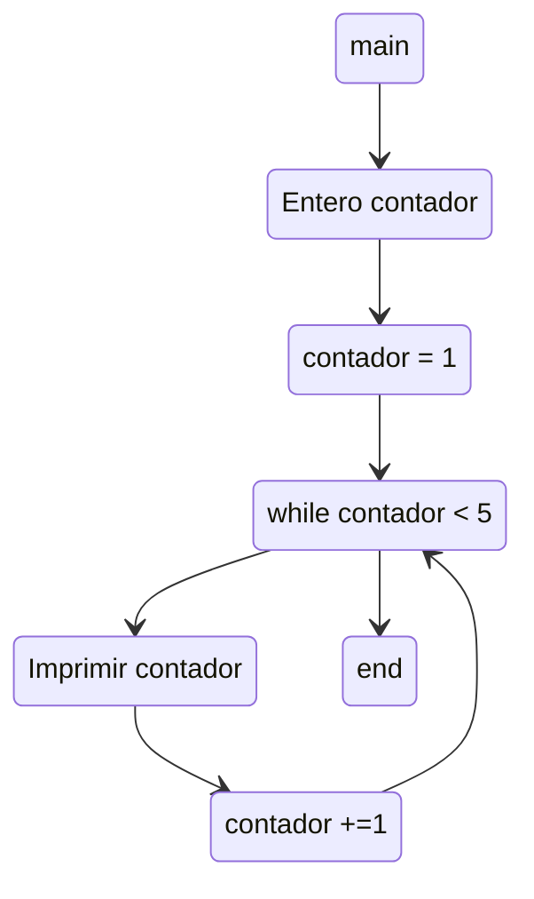

```mermaid
stateDiagram-v2
state "Entero contador" as cont
state "contador = 1" as valor
state "while contador < 5" as cond
state "Imprimir contador" as print
state "contador +=1" as suma
    main --> cont
    cont --> valor
    valor --> cond
    cond --> end
    cond --> print
    print --> suma
    suma --> cond
    
```
    
