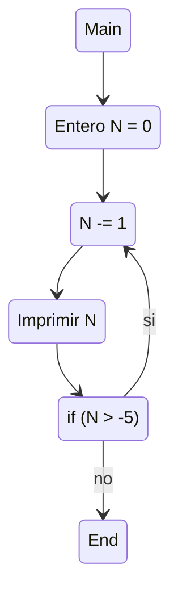

# Ejercicio 4: Escriba un diagrama de flujo que permita generar e imprimir los primeros 5 números enteros negativos.

```mermaid
stateDiagram-v2
state "Entero N = 0" as DEC1
state "if (N > -5)" as COND1
state "Imprimir N" as OUT1
state "N -= 1" as RES1
    Main --> DEC1
    DEC1 --> RES1
    RES1 --> OUT1
    OUT1 --> COND1
    COND1 --> RES1 : si
    COND1 --> End : no    
```
