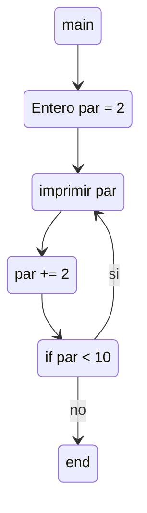

```mermaid
stateDiagram-v2
state "Entero par = 2" as par
state "imprimir par" as print
state "par += 2" as suma
state "if par < 10" as cond
    main --> par
    par --> print
    print --> suma
    suma --> cond
    cond --> print: si
    cond --> end: no
```