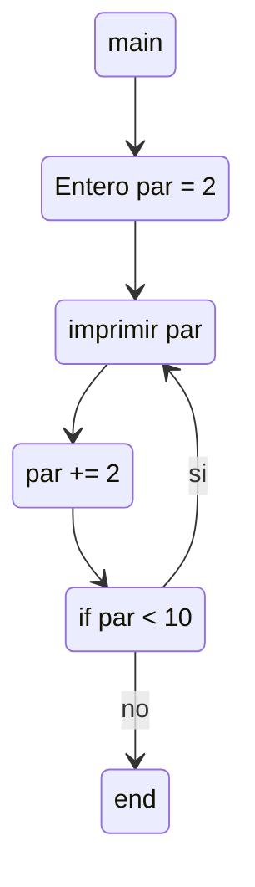

#### Ejercicio 6) Escriba un diagrama de flujo que permita generar e imprimir los primeros 5 números naturales
pares (a partir de 2). 

```mermaid
stateDiagram-v2
state "Entero par = 2" as par
state "imprimir par" as print
state "par += 2" as suma
state "if par < 10" as cond
    main --> par
    par --> print
    print --> suma
    suma --> cond
    cond --> print: si
    cond --> end: no
```
