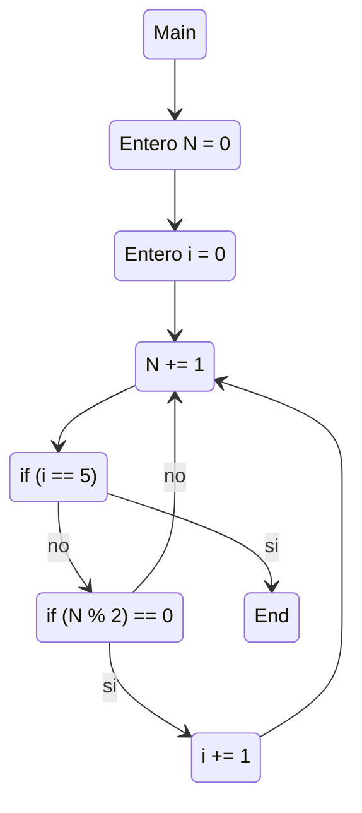

# Ejercicio 7: Escriba un diagrama de flujo que permita generar e imprimir los primeros 5 números naturales impares (a partir de 1)

```mermaid
stateDiagram-v2
state "Entero N = 0" as DEC1
state "Entero i = 0" as DEC2
state "N += 1" as RES1
state "i += 1" as RES2
state "if (i == 5)" as COND1
state "if (N % 2) == 0" as COND2
    Main --> DEC1
    DEC1 --> DEC2
    DEC2 --> RES1
    RES1 --> COND1
    COND1 --> End : si
    COND1 --> COND2 : no
    COND2 --> RES2 : si
    RES2 --> RES1
    COND2 --> RES1 : no
```
