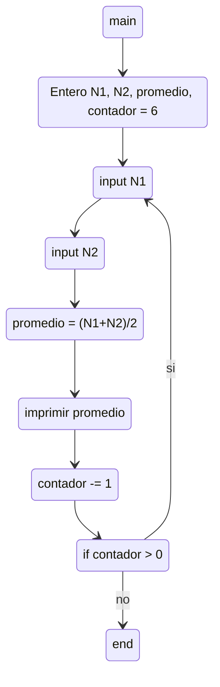

#### Ejercicio 8) Escriba un diagrama de flujo que permita ingresar 6 pares de números naturales que representan
notas de parciales, en las variables N1 y N2, y que calcule e imprima el promedio de cada par de
notas. 

