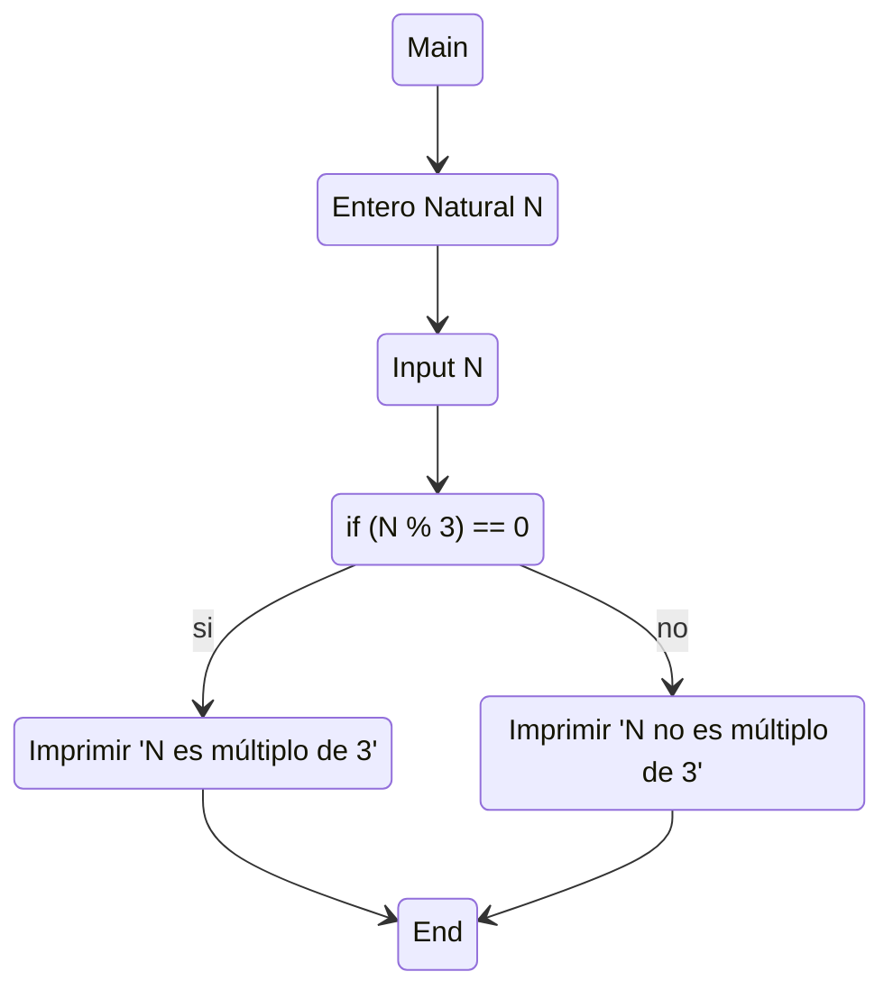

# Ejercicio 9: Ingresar un número natural en la variable A. Determinar e imprimir un mensaje informando: si A es múltiplo de 3 o no.

```mermaid
stateDiagram-v2
state "Entero Natural N" as DEF1
state "Input N" as IN1
state "if (N % 3) == 0" as COND1
state "Imprimir 'N es múltiplo de 3'" as OUT1
state "Imprimir 'N no es múltiplo de 3'" as OUT2
    Main --> DEF1
    DEF1 --> IN1
    IN1 --> COND1
    COND1 --> OUT1 : si
    COND1 --> OUT2 : no
    OUT1 --> End
    OUT2 --> End
```
